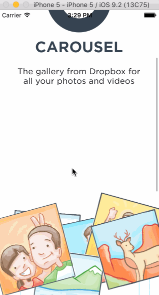

# Codepath Assignment #2

**Carousel Onboarding** Code Path Assignment 2

Submitted by: **Jisi Guo**

Time spent: **10** hours spent in total

## User Stories

Static photo tiles on the initial screen
Optional: Photo tiles move with scrolling

Sign In
Tapping on email/password reveals the keyboard and shifts the scrollview and Sign In button up.
Upon tapping the Sign In button.
If the username or password fields are empty, user sees an error alert.
If credentials are incorrect, user sees a loading indicator for 2 seconds followed by an error alert.
If the credentials are correct, user sees a loading indicator for 2 seconds followed by a transition to the Sign In screens.
Optional: When the keyboard is visible, if the user pulls down on the scrollview, it will dismiss the keyboard.

Tutorial Screens
User can page between the screens
Optional: User can page between the screens with updated dots
Optional: Upon reaching the 4th page, hide the dots and show the "Take Carousel for a Spin" button.

Image Timeline
Display a scrollable view of images.
User can tap on the conversations button to see the conversations screen (push).
User can tap on the profile image to see the settings view (modal from below).

Conversations
User can dismiss the conversations screen

Settings
User can dismiss the settings screen.
User can log out

## Video Walkthrough 

Here's a walkthrough of implemented user stories:

GIF created with [LiceCap](http://www.cockos.com/licecap/).

## Notes

Describe any challenges encountered while building the app.

## License

    Copyright [yyyy] [name of copyright owner]

    Licensed under the Apache License, Version 2.0 (the "License");
    you may not use this file except in compliance with the License.
    You may obtain a copy of the License at

        http://www.apache.org/licenses/LICENSE-2.0

    Unless required by applicable law or agreed to in writing, software
    distributed under the License is distributed on an "AS IS" BASIS,
    WITHOUT WARRANTIES OR CONDITIONS OF ANY KIND, either express or implied.
    See the License for the specific language governing permissions and
    limitations under the License.
